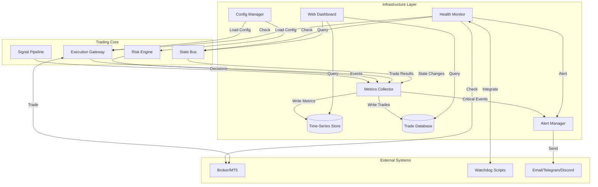
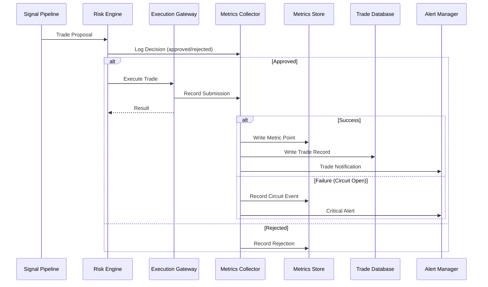

# Design Document: Infrastructure Layer for EdgeLab Trading Bot

## Overview

This document defines the architecture for EdgeLab's production infrastructure layer, enabling robust live trading through comprehensive monitoring, observability, persistence, and operational management. The infrastructure layer provides six core capabilities: (1) time-series metrics collection and storage for tracking equity, PnL, positions, signals, and circuit breaker events; (2) persistent data storage for trade history, decision logs, and system state with crash recovery; (3) hot-reloadable configuration management with validation and environment-specific profiles; (4) automated health monitoring with periodic checks, recovery procedures, and watchdog integration; (5) real-time web dashboard for position monitoring, equity visualization, and system status; (6) multi-channel alerting for critical events, trade notifications, and system failures.

The design maintains EdgeLab's architectural principles: pure Python standard library for core components where possible, clear separation of concerns, testable components, and defense-in-depth through layered safety mechanisms. All infrastructure components integrate with the existing StateBus, TradingLogger, and execution gateway without requiring modifications to the risk engine or signal pipeline.

## Architecture

### High-Level System Architecture



### Component Interaction Flow



## Components and Interfaces

### Component 1: Metrics Collector

**Purpose**: Central hub for collecting, aggregating, and routing all system metrics, trade events, and decision logs to appropriate storage backends.

**Interface**:
```python
from dataclasses import dataclass
from datetime import datetime
from enum import Enum
from typing import Optional, Dict, Any


class MetricType(Enum):
    EQUITY = "equity"
    PNL = "pnl"
    POSITION_COUNT = "position_count"
    SIGNAL_GENERATED = "signal_generated"
    SIGNAL_APPROVED = "signal_approved"
    SIGNAL_REJECTED = "signal_rejected"
    CIRCUIT_BREAKER_OPENED = "circuit_breaker_opened"
    CIRCUIT_BREAKER_CLOSED = "circuit_breaker_closed"
    DAILY_LOSS_LOCK = "daily_loss_lock"
    TOTAL_DD_LOCK = "total_dd_lock"
    SPREAD_BLOCKED = "spread_blocked"
    EXECUTION_LATENCY = "execution_latency"


@dataclass
class MetricPoint:
    """Single metric data point."""
    timestamp: datetime
    metric_type: MetricType
    value: float
    tags: Dict[str, str]  # e.g., {"symbol": "XAUUSD", "strategy": "trend"}


@dataclass
class TradeEvent:
    """Trade lifecycle event."""
    trade_id: str
    timestamp: datetime
    event_type: str  # "entry", "exit", "modify"
    symbol: str
    direction: str  # "long", "short"
    entry_price: Optional[float]
    exit_price: Optional[float]
    quantity: float
    pnl: Optional[float]
    exit_reason: Optional[str]  # "take_profit", "stop_loss", "manual"
    metadata: Dict[str, Any]


@dataclass
class DecisionEvent:
    """Risk engine decision event."""
    decision_id: str
    timestamp: datetime
    signal_id: str
    approved: bool
    rejection_reason: Optional[str]
    confidence: float
    risk_metrics: Dict[str, float]  # exposure, position_size, etc.
    metadata: Dict[str, Any]


class MetricsCollector:
    """Collects and routes metrics to storage backends."""
    
    def __init__(self, store: 'MetricsStore', trade_db: 'TradeDatabase', 
                 alert_mgr: 'AlertManager', logger: 'TradingLogger'):
        """Initialize collector with storage backends."""
        pass
    
    def record_metric(self, point: MetricPoint) -> None:
        """Record a single metric point."""
        pass
    
    def record_trade_event(self, event: TradeEvent) -> None:
        """Record a trade lifecycle event."""
        pass
    
    def record_decision(self, decision: DecisionEvent) -> None:
        """Record a risk engine decision."""
        pass
    
    def record_circuit_breaker_event(self, breaker_name: str, state: str, 
                                     reason: str) -> None:
        """Record circuit breaker state change."""
        pass
    
    def flush(self) -> None:
        """Flush any buffered metrics to storage."""
        pass
```

**Responsibilities**:
- Collect metrics from all trading system components
- Transform events into standardized format
- Route metrics to appropriate storage (time-series vs relational)
- Trigger alerts for critical events
- Buffer metrics for batch writes (performance optimization)
- Handle storage failures gracefully (buffering, circuit breaker)

### Component 2: Metrics Store (Time-Series Database)

**Purpose**: Persistent storage for time-series metrics enabling historical analysis, performance tracking, and dashboard visualization.

**Technology Choice**: SQLite with time-series optimizations (lightweight, single-file, no separate process, sufficient for <1M points/day)

**Interface**:
```python
from typing import List, Tuple
from datetime import datetime


class MetricsStore:
    """Time-series metrics storage using SQLite."""
    
    def __init__(self, db_path: str, logger: 'TradingLogger'):
        """Initialize metrics store with database path."""
        pass
    
    def write_point(self, point: MetricPoint) -> None:
        """Write a single metric point."""
        pass
    
    def write_batch(self, points: List[MetricPoint]) -> None:
        """Write multiple metric points in a transaction."""
        pass
    
    def query_range(self, metric_type: MetricType, start: datetime, 
                    end: datetime, tags: Optional[Dict[str, str]] = None) -> List[Tuple[datetime, float]]:
        """Query metrics within time range with optional tag filters."""
        pass
    
    def query_latest(self, metric_type: MetricType, limit: int = 100) -> List[Tuple[datetime, float]]:
        """Query most recent N points for a metric."""
        pass
    
    def aggregate(self, metric_type: MetricType, start: datetime, end: datetime,
                  interval: str, agg_func: str = "avg") -> List[Tuple[datetime, float]]:
        """Aggregate metrics by time interval (e.g., hourly, daily)."""
        pass
    
    def close(self) -> None:
        """Close database connection."""
        pass
```

**Schema Design**:
```sql
CREATE TABLE metrics (
    id INTEGER PRIMARY KEY AUTOINCREMENT,
    timestamp INTEGER NOT NULL,  -- Unix timestamp for efficient indexing
    metric_type TEXT NOT NULL,
    value REAL NOT NULL,
    tags TEXT  -- JSON-encoded tag dictionary
);

CREATE INDEX idx_timestamp ON metrics(timestamp);
CREATE INDEX idx_metric_type_timestamp ON metrics(metric_type, timestamp);
```

**Responsibilities**:
- Persist time-series metric points
- Provide efficient range queries for dashboard
- Support aggregation queries (hourly, daily, weekly averages)
- Maintain indexes for query performance
- Handle write failures with retry logic

### Component 3: Trade Database

**Purpose**: Persistent relational storage for all trade history, decision logs, and audit trails with full context preservation.

**Technology Choice**: SQLite (consistent with metrics store, transactional guarantees)


**Interface**:
```python
from typing import List, Optional


class TradeDatabase:
    """Relational storage for trades and decisions."""
    
    def __init__(self, db_path: str, logger: 'TradingLogger'):
        """Initialize trade database."""
        pass
    
    def insert_trade(self, event: TradeEvent) -> None:
        """Insert a trade event (entry, exit, modify)."""
        pass
    
    def insert_decision(self, decision: DecisionEvent) -> None:
        """Insert a risk engine decision."""
        pass
    
    def get_trades(self, start: Optional[datetime] = None, 
                   end: Optional[datetime] = None,
                   symbol: Optional[str] = None) -> List[TradeEvent]:
        """Query trades with optional filters."""
        pass
    
    def get_open_trades(self) -> List[TradeEvent]:
        """Get all currently open trades."""
        pass
    
    def get_decisions(self, start: Optional[datetime] = None,
                      end: Optional[datetime] = None,
                      approved: Optional[bool] = None) -> List[DecisionEvent]:
        """Query decisions with optional filters."""
        pass
    
    def checkpoint_state(self, state_snapshot: Dict[str, Any]) -> None:
        """Save system state for crash recovery."""
        pass
    
    def restore_state(self) -> Optional[Dict[str, Any]]:
        """Restore last checkpointed system state."""
        pass
    
    def close(self) -> None:
        """Close database connection."""
        pass
```

**Schema Design**:
```sql
CREATE TABLE trades (
    id INTEGER PRIMARY KEY AUTOINCREMENT,
    trade_id TEXT UNIQUE NOT NULL,
    timestamp INTEGER NOT NULL,
    event_type TEXT NOT NULL,
    symbol TEXT NOT NULL,
    direction TEXT NOT NULL,
    entry_price REAL,
    exit_price REAL,
    quantity REAL NOT NULL,
    pnl REAL,
    exit_reason TEXT,
    metadata TEXT  -- JSON
);

CREATE TABLE decisions (
    id INTEGER PRIMARY KEY AUTOINCREMENT,
    decision_id TEXT UNIQUE NOT NULL,
    timestamp INTEGER NOT NULL,
    signal_id TEXT NOT NULL,
    approved INTEGER NOT NULL,  -- 0=false, 1=true
    rejection_reason TEXT,
    confidence REAL NOT NULL,
    risk_metrics TEXT,  -- JSON
    metadata TEXT  -- JSON
);

CREATE TABLE state_checkpoints (
    id INTEGER PRIMARY KEY AUTOINCREMENT,
    timestamp INTEGER NOT NULL,
    state_data TEXT NOT NULL  -- JSON snapshot
);

CREATE INDEX idx_trades_timestamp ON trades(timestamp);
CREATE INDEX idx_trades_symbol ON trades(symbol);
CREATE INDEX idx_decisions_timestamp ON decisions(timestamp);
```

**Responsibilities**:
- Persist all trade lifecycle events (entry, exit, modifications)
- Store all risk engine decisions with full context
- Provide audit trail for compliance and analysis
- Support system state checkpointing for crash recovery
- Enable post-trade analysis and performance attribution

### Component 4: Configuration Manager

**Purpose**: Hot-reloadable configuration management with validation, environment profiles, and secret handling.


**Interface**:
```python
from typing import Any, Callable, Dict
from pathlib import Path


class ConfigManager:
    """Hot-reloadable configuration manager."""
    
    def __init__(self, config_path: Path, env: str = "demo", logger: 'TradingLogger'):
        """Initialize config manager with base config path and environment."""
        pass
    
    def load(self) -> Dict[str, Any]:
        """Load and validate configuration."""
        pass
    
    def reload(self) -> bool:
        """Reload configuration from disk, return True if changed."""
        pass
    
    def get(self, key: str, default: Any = None) -> Any:
        """Get configuration value by dotted key path."""
        pass
    
    def watch(self, callback: Callable[[Dict[str, Any]], None]) -> None:
        """Register callback for configuration changes."""
        pass
    
    def validate(self, config: Dict[str, Any]) -> Tuple[bool, List[str]]:
        """Validate configuration, return (is_valid, errors)."""
        pass
    
    def get_secret(self, key: str) -> Optional[str]:
        """Retrieve secret from secure storage (env var or keyring)."""
        pass
```

**Configuration Structure**:
```yaml
# config/trading.{env}.yaml (env: demo, live, backtest)

broker:
  mode: tradelocker
  login: ${BROKER_LOGIN}  # Environment variable substitution
  password: ${BROKER_PASSWORD}
  server: "TradeLocker-Demo"
  symbol_canonical: "XAUUSD"
  
risk:
  firm_preset: blueberry_1step
  internal_risk:
    risk_per_trade_pct: 0.01
    daily_loss_lock_pct: 0.02
    total_dd_lock_pct: 0.05

infrastructure:
  metrics:
    enabled: true
    db_path: "data/metrics.db"
    batch_size: 100
    flush_interval_sec: 10
  
  trade_db:
    enabled: true
    db_path: "data/trades.db"
    checkpoint_interval_sec: 300
  
  health_monitor:
    enabled: true
    check_interval_sec: 60
    broker_timeout_sec: 10
    equity_check_enabled: true
  
  alerts:
    enabled: true
    channels:
      - type: console
      - type: file
        path: "logs/alerts.log"
      - type: email
        smtp_host: ${SMTP_HOST}
        smtp_port: 587
        from_addr: ${ALERT_EMAIL_FROM}
        to_addrs: ${ALERT_EMAIL_TO}
      - type: telegram
        bot_token: ${TELEGRAM_BOT_TOKEN}
        chat_id: ${TELEGRAM_CHAT_ID}
  
  dashboard:
    enabled: true
    host: "127.0.0.1"
    port: 8080
    update_interval_sec: 5
```

**Responsibilities**:
- Load environment-specific configurations
- Validate configuration on load and reload
- Support hot-reloading without system restart
- Substitute environment variables securely
- Provide dotted-key access to nested config values
- Notify components of configuration changes

### Component 5: Health Monitor

**Purpose**: Automated health checking with periodic validation, recovery procedures, and watchdog integration.

**Interface**:
```python
from dataclasses import dataclass
from enum import Enum
from typing import List, Callable


class HealthStatus(Enum):
    HEALTHY = "healthy"
    DEGRADED = "degraded"
    CRITICAL = "critical"


@dataclass
class HealthCheck:
    """Health check result."""
    name: str
    status: HealthStatus
    message: str
    timestamp: datetime
    details: Dict[str, Any]


class HealthMonitor:
    """Automated health checking and recovery."""
    
    def __init__(self, config: Dict[str, Any], state_bus: 'StateBus',
                 broker: 'BrokerInterface', logger: 'TradingLogger'):
        """Initialize health monitor."""
        pass
    
    def check_broker_connection(self) -> HealthCheck:
        """Verify broker connection is alive."""
        pass
    
    def check_data_feed(self) -> HealthCheck:
        """Verify data feed is fresh (not stale)."""
        pass
    
    def check_equity(self) -> HealthCheck:
        """Verify equity is within expected bounds."""
        pass
    
    def check_circuit_breakers(self) -> HealthCheck:
        """Check circuit breaker states."""
        pass
    
    def check_system_resources(self) -> HealthCheck:
        """Check CPU, memory, disk space."""
        pass
    
    def run_all_checks(self) -> List[HealthCheck]:
        """Run all health checks, return results."""
        pass
    
    def start(self) -> None:
        """Start periodic health checking in background thread."""
        pass
    
    def stop(self) -> None:
        """Stop periodic health checking."""
        pass
    
    def register_recovery_action(self, check_name: str, 
                                 action: Callable[[], bool]) -> None:
        """Register automated recovery action for a check."""
        pass
```

**Health Checks**:
1. **Broker Connection**: Test connection to MT5/TradeLocker, verify latency < threshold
2. **Data Feed Freshness**: Ensure latest tick/bar is within expected time window
3. **Equity Bounds**: Verify current equity matches expected range (no silent losses)
4. **Circuit Breaker Status**: Check for open circuit breakers that need attention
5. **Lockout Status**: Verify daily loss and total DD locks are not stuck
6. **System Resources**: Monitor CPU, memory, disk space
7. **Database Health**: Verify metrics and trade DB are writable
8. **Log File Rotation**: Check log files are not filling disk

**Responsibilities**:
- Run periodic health checks on all critical components
- Detect degraded states before they become critical
- Execute automated recovery actions (reconnect broker, reset circuit breaker)
- Integrate with watchdog scripts for process-level monitoring
- Log all health check results for trend analysis
- Alert on DEGRADED or CRITICAL states

### Component 6: Alert Manager

**Purpose**: Multi-channel alerting system for critical events, trade notifications, and system failures.

**Interface**:
```python
from enum import Enum
from typing import List


class AlertSeverity(Enum):
    INFO = "info"
    WARNING = "warning"
    CRITICAL = "critical"


@dataclass
class Alert:
    """Alert message."""
    severity: AlertSeverity
    title: str
    message: str
    timestamp: datetime
    metadata: Dict[str, Any]


class AlertChannel(ABC):
    """Abstract alert channel."""
    
    @abstractmethod
    def send(self, alert: Alert) -> bool:
        """Send alert, return True if successful."""
        pass


class ConsoleAlertChannel(AlertChannel):
    """Console output channel."""
    pass


class FileAlertChannel(AlertChannel):
    """File output channel."""
    pass


class EmailAlertChannel(AlertChannel):
    """Email notification channel."""
    pass


class TelegramAlertChannel(AlertChannel):
    """Telegram bot channel."""
    pass


class AlertManager:
    """Multi-channel alert manager."""
    
    def __init__(self, config: Dict[str, Any], logger: 'TradingLogger'):
        """Initialize alert manager with configured channels."""
        pass
    
    def send_alert(self, alert: Alert) -> None:
        """Send alert to all configured channels."""
        pass
    
    def send_trade_notification(self, event: TradeEvent) -> None:
        """Send trade notification (entry/exit)."""
        pass
    
    def send_critical_event(self, title: str, message: str, 
                           metadata: Dict[str, Any]) -> None:
        """Send critical event alert."""
        pass
    
    def add_channel(self, channel: AlertChannel) -> None:
        """Add alert channel."""
        pass
```

**Alert Categories**:
1. **Critical Alerts** (immediate attention required)
   - Daily loss lock triggered
   - Total DD lock triggered
   - Circuit breaker opened (execution failures)
   - Broker disconnection
   - Data feed stale (>5 minutes)
   - System crash/restart

2. **Trade Notifications** (informational)
   - Trade entry (symbol, direction, size, price)
   - Trade exit (PnL, duration, exit reason)
   - Order rejection (reason)

3. **System Alerts** (informational)
   - Configuration reloaded
   - Health check degraded
   - Watchdog restart
   - Database checkpoint saved

**Responsibilities**:
- Route alerts to appropriate channels based on severity
- Support multiple notification channels (console, file, email, telegram, discord)
- Rate-limit alerts to prevent notification spam
- Retry failed deliveries with exponential backoff
- Log all sent alerts for audit trail
- Provide alert templates for common events

### Component 7: Web Dashboard

**Purpose**: Real-time web-based monitoring interface for positions, equity, performance stats, and system status.

**Technology Choice**: Flask (lightweight, pure Python) + Chart.js (frontend visualization)

**Interface**:
```python
class WebDashboard:
    """Real-time web dashboard server."""
    
    def __init__(self, config: Dict[str, Any], metrics_store: MetricsStore,
                 trade_db: TradeDatabase, state_bus: 'StateBus',
                 logger: 'TradingLogger'):
        """Initialize dashboard."""
        pass
    
    def start(self) -> None:
        """Start dashboard server in background thread."""
        pass
    
    def stop(self) -> None:
        """Stop dashboard server."""
        pass
    
    def get_current_state(self) -> Dict[str, Any]:
        """Get current system state snapshot."""
        pass
    
    def get_equity_series(self, period: str = "1d") -> List[Tuple[datetime, float]]:
        """Get equity curve data for charting."""
        pass
    
    def get_performance_stats(self) -> Dict[str, float]:
        """Get performance statistics (win rate, avg PnL, etc.)."""
        pass
    
    def get_recent_trades(self, limit: int = 10) -> List[TradeEvent]:
        """Get recent trades for display."""
        pass
```

**Dashboard Views**:

1. **Overview Page** (default landing)
   - Current equity (large display)
   - Today's PnL (percentage and dollar)
   - Open positions count
   - Active lockouts/circuit breakers (warning badges)
   - System status (green/yellow/red indicator)

2. **Equity Chart Page**
   - Interactive equity curve (Chart.js line chart)
   - Time range selector (1D, 1W, 1M, 3M, ALL)
   - Drawdown overlay
   - Trade markers on chart

3. **Positions Page**
   - Live open positions table
   - Symbol, direction, entry price, current price, unrealized PnL
   - Position size, time held
   - Auto-refresh every 5 seconds

4. **Trade History Page**
   - Paginated trade history table
   - Date range filter
   - Symbol filter
   - PnL column with color coding (green/red)
   - Export to CSV button

5. **Performance Stats Page**
   - Win rate
   - Average win / average loss
   - Profit factor
   - Max drawdown
   - Daily/weekly/monthly returns
   - Sharpe ratio

6. **System Status Page**
   - Health check results (all checks)
   - Circuit breaker states
   - Lockout status
   - Database sizes
   - System uptime
   - Recent alerts log

**Responsibilities**:
- Serve real-time dashboard on configurable host/port
- Query metrics store and trade database for data
- Provide RESTful API endpoints for frontend
- Auto-refresh data at configurable intervals
- Support basic authentication (optional)
- Log all dashboard access for security audit

## Data Models

### Metric Point Model

```python
@dataclass
class MetricPoint:
    timestamp: datetime
    metric_type: MetricType
    value: float
    tags: Dict[str, str]
```

**Validation Rules**:
- `timestamp` must be UTC datetime
- `metric_type` must be valid MetricType enum
- `value` must be finite float (not NaN, not Inf)
- `tags` must be flat dictionary of string keys/values

### Trade Event Model

```python
@dataclass
class TradeEvent:
    trade_id: str
    timestamp: datetime
    event_type: str
    symbol: str
    direction: str
    entry_price: Optional[float]
    exit_price: Optional[float]
    quantity: float
    pnl: Optional[float]
    exit_reason: Optional[str]
    metadata: Dict[str, Any]
```

**Validation Rules**:
- `trade_id` must be unique UUID4
- `timestamp` must be UTC datetime
- `event_type` must be one of: "entry", "exit", "modify"
- `symbol` must be valid symbol string
- `direction` must be "long" or "short"
- `entry_price` required for "entry" events
- `exit_price` and `pnl` required for "exit" events
- `quantity` must be positive
- `metadata` can contain arbitrary JSON-serializable data

### Decision Event Model

```python
@dataclass
class DecisionEvent:
    decision_id: str
    timestamp: datetime
    signal_id: str
    approved: bool
    rejection_reason: Optional[str]
    confidence: float
    risk_metrics: Dict[str, float]
    metadata: Dict[str, Any]
```

**Validation Rules**:
- `decision_id` must be unique UUID4
- `timestamp` must be UTC datetime
- `signal_id` must match signal that triggered decision
- `rejection_reason` required if `approved=False`
- `confidence` must be in range [0.0, 1.0]
- `risk_metrics` must contain at least: `exposure_pct`, `position_size`

## Error Handling

### Error Scenario 1: Metrics Store Write Failure

**Condition**: SQLite database is locked or disk is full during metrics write

**Response**: 
- Buffer metric points in memory (bounded queue, max 10,000 points)
- Log error and retry write with exponential backoff
- If buffer is full, drop oldest metrics (FIFO)
- Alert on sustained write failures (>1 minute)

**Recovery**: 
- Once disk space available or lock released, flush buffered metrics
- Log count of dropped metrics if any
- Continue normal operation

### Error Scenario 2: Broker Connection Lost

**Condition**: Health monitor detects broker disconnection

**Response**:
- Mark health check as CRITICAL
- Send critical alert to all channels
- Attempt reconnection with exponential backoff (5s, 10s, 20s, 40s, max 60s)
- Block new trade submissions until reconnected
- Do NOT close existing positions

**Recovery**:
- On successful reconnection, verify open positions match expected state
- Send recovery alert
- Resume normal operation

### Error Scenario 3: Configuration Reload Failure

**Condition**: Configuration file is malformed or validation fails during reload

**Response**:
- Log validation errors with specific field names
- Keep previous valid configuration active
- Alert operator of failed reload
- Do NOT apply partial configuration

**Recovery**:
- Operator fixes configuration file
- System automatically attempts reload on next watch interval
- Alert on successful reload

### Error Scenario 4: Dashboard Server Crash

**Condition**: Flask dashboard server raises unhandled exception

**Response**:
- Log full exception traceback
- Attempt automatic restart after 10-second delay
- Alert operator of dashboard crash
- Trading system continues operating (dashboard is non-critical)

**Recovery**:
- Dashboard restarts and resumes serving
- Alert on successful restart
- If restart fails 3 times, disable dashboard and alert

### Error Scenario 5: Alert Delivery Failure

**Condition**: Email/Telegram delivery fails due to network or credential issues

**Response**:
- Log failed delivery attempt with error details
- Buffer failed alerts (max 100 alerts)
- Retry delivery with exponential backoff
- Always log alerts to file as backup

**Recovery**:
- On successful delivery, flush buffered alerts
- Alert operator if sustained delivery failures (>5 minutes)

## Testing Strategy

### Unit Testing Approach

Each infrastructure component will have comprehensive unit tests:

**MetricsCollector Tests**:
- Test metric point recording
- Test batch metric writes
- Test alert triggering on critical events
- Test buffering behavior on storage failure
- Test flush operations

**MetricsStore Tests**:
- Test SQLite schema creation
- Test point insertion and batch insertion
- Test range queries and aggregation queries
- Test index usage for performance
- Test connection error handling

**TradeDatabase Tests**:
- Test trade event insertion
- Test decision event insertion
- Test query filters (time range, symbol, approval status)
- Test state checkpointing and restoration
- Test concurrent access (threading)

**ConfigManager Tests**:
- Test configuration loading and validation
- Test environment variable substitution
- Test hot-reload detection
- Test callback notification on changes
- Test secret retrieval

**HealthMonitor Tests**:
- Test each health check independently
- Test periodic check scheduling
- Test recovery action execution
- Test alert triggering on health degradation
- Test background thread lifecycle

**AlertManager Tests**:
- Test alert routing to multiple channels
- Test rate limiting
- Test retry logic with exponential backoff
- Test alert buffering on delivery failure
- Test each alert channel independently

**WebDashboard Tests**:
- Test Flask routes and endpoints
- Test data serialization for API
- Test query performance with large datasets
- Test concurrent request handling
- Test authentication (if enabled)

### Integration Testing Approach

Integration tests will verify component interactions:

**End-to-End Metrics Flow**:
- Generate trade event → MetricsCollector → MetricsStore → Dashboard query
- Verify data appears in dashboard within expected time
- Verify alert triggered for critical event

**Configuration Hot-Reload**:
- Modify config file → ConfigManager detects change → Components reload config
- Verify components use new configuration
- Verify no disruption to active trades

**Health Monitor → Alert Manager**:
- Trigger health check failure → HealthMonitor detects → AlertManager notifies
- Verify alert delivered to all channels
- Verify recovery action executed

**Crash Recovery**:
- Checkpoint state → Simulate crash → Restore state from database
- Verify all open positions and equity restored
- Verify system resumes normal operation

**Dashboard Performance**:
- Load 1M metric points → Query equity curve → Verify response time < 1s
- Test concurrent dashboard users (10 simultaneous queries)
- Verify no impact on trading loop performance

## Performance Considerations

### Metric Collection Performance

- **Batch Writes**: Buffer metrics and write in batches of 100 points every 10 seconds
- **Async Writes**: Use background thread for database writes (non-blocking)
- **Connection Pooling**: Reuse SQLite connections (single connection per store)
- **Index Optimization**: Create indexes on timestamp and metric_type columns
- **Retention Policy**: Archive metrics older than 1 year to separate database

### Database Query Performance

- **Query Limits**: Always use LIMIT clauses for unbounded queries
- **Time Range Filters**: Dashboard queries should specify time ranges (e.g., last 24 hours)
- **Prepared Statements**: Use parameterized queries to avoid SQL injection and improve performance
- **Aggregation Caching**: Cache aggregated metrics (hourly, daily) for faster dashboard loading
- **Read Replicas**: For high dashboard traffic, consider read replica (future enhancement)

### Alert Rate Limiting

- **Deduplication Window**: Do not send duplicate alerts within 5-minute window
- **Severity Throttling**: INFO alerts max 10/min, WARNING max 5/min, CRITICAL unlimited
- **Batch Notifications**: Group similar alerts into single notification
- **Channel Limits**: Respect API rate limits for Telegram/Discord/email services

### Dashboard Scalability

- **Data Pagination**: Paginate trade history (max 100 trades per page)
- **Chart Data Decimation**: Downsample equity curve for long time ranges (e.g., 10,000 points max)
- **Caching**: Cache frequently accessed data (performance stats, current positions) for 5 seconds
- **WebSocket Updates**: Use WebSocket for real-time position updates (future enhancement)
- **Static Asset CDN**: Serve Chart.js and CSS from CDN for faster loading

## Security Considerations

### Credential Management

- **Environment Variables**: Store all secrets in environment variables, never in code
- **Keyring Integration**: Support OS keyring (Windows Credential Manager, macOS Keychain) for secrets
- **Config File Permissions**: Restrict config files to trading user only (chmod 600)
- **No Logging of Secrets**: Scrub sensitive values from logs
- **Separate Demo/Live Configs**: Never use same credentials across environments

### Dashboard Security

- **Authentication**: Require username/password for dashboard access (optional but recommended)
- **HTTPS**: Support TLS for dashboard (self-signed cert acceptable for VPS)
- **CORS**: Restrict dashboard API to same-origin requests
- **Rate Limiting**: Limit API requests per IP (100 req/min) to prevent abuse
- **Access Logging**: Log all dashboard access attempts with IP addresses

### Database Security

- **File Permissions**: Restrict database files to trading user only
- **No Remote Access**: SQLite databases should never be exposed over network
- **Backup Encryption**: Encrypt database backups (future enhancement)
- **SQL Injection Prevention**: Always use parameterized queries
- **Connection Limits**: Limit concurrent database connections

### Alert Security

- **Channel Validation**: Validate email addresses and Telegram chat IDs on startup
- **Token Rotation**: Support token rotation for Telegram bot without restart
- **No Sensitive Data in Alerts**: Never include account credentials in alert messages
- **Secure Transport**: Use TLS for all email and HTTP webhook deliveries
- **Alert Log Retention**: Retain alert logs for audit trail (7 days minimum)

## Dependencies

### Required Python Packages

**Standard Library** (no installation required):
- `sqlite3` - Database backend for metrics and trades
- `threading` - Background threads for health monitor and dashboard
- `logging` - Structured logging (via existing TradingLogger)
- `json` - JSON serialization for database storage
- `pathlib` - File path handling
- `datetime` - Timestamp handling
- `typing` - Type hints

**Third-Party Packages** (add to requirements.txt):
- `flask==2.3.0` - Web dashboard server
- `pyyaml==6.0` - YAML configuration parsing
- `psutil==5.9.0` - System resource monitoring (CPU, memory)
- `requests==2.31.0` - HTTP requests for webhooks (optional)

**Optional Packages** (for enhanced features):
- `python-telegram-bot==20.0` - Telegram bot integration
- `keyring==24.0.0` - OS keyring integration for secrets
- `cryptography==41.0.0` - Database backup encryption (future)

### External Services

**Optional External Services**:
- **SMTP Server**: For email alerts (Gmail, SendGrid, etc.)
- **Telegram Bot API**: For Telegram notifications (free)
- **Discord Webhooks**: For Discord notifications (free)

**No Required External Services**: System operates fully offline with console/file alerts only.

### Integration with Existing EdgeLab Components

**Required Integrations**:
- `StateBus`: Read current equity, positions, lockout status
- `TradingLogger`: Use for all infrastructure logging
- `BrokerInterface`: Health checks need broker connection status
- `Config`: Read existing trading.yaml configuration
- `RiskEngine`: Listen for decision events
- `ExecutionGateway`: Listen for trade results and circuit breaker events

**No Modifications Required**: Infrastructure layer integrates via event listeners and queries, no changes to existing core components.
